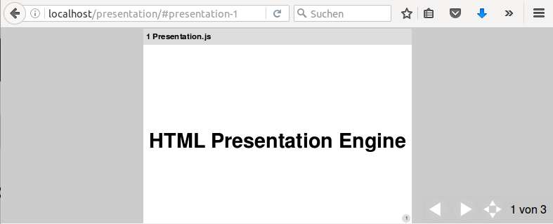

# jPresentation

 a in-Browser presentation engine with server-side markdown-slides and pdf-download.

## Features

- presentation.js
    - no dependencies (like jQuery or Bootstrap. pur js and css)
    - support key-events, touch-events, mousewheel-events
    - fullscreen-mode
    - hashtag-Navigation
    - supports all modern Browser and devices
- server-site
    - each slide in one markdown-File (vie ParseDown)
    - pdf-download of presentation (vie domPDF)